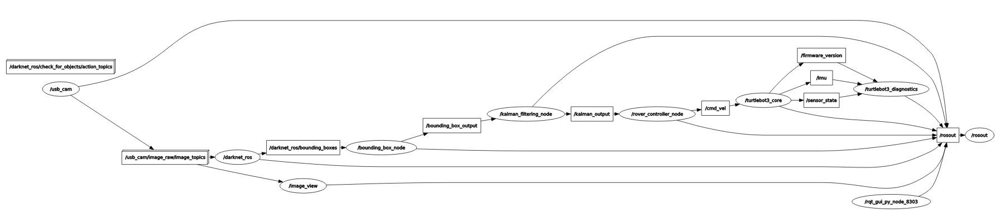

<h1 align="center">TrackerBot: Object Detectation and Tracking using Turtle Bot</h1>

<p align="center">

</p>


> **Abstract:** *Autonomous rovers are mobile robots, designed to operate in various conditions without any human intervention. These rovers are equipped with sensors, actuators, and control systems that enable them to navigate and interact with their environment. They are widely employed in fields like exploration, search and rescue, environmental monitoring, and surveillance. This research presents the construction and development of an autonomous rover that integrates parallel object tracking, videography, and collision avoidance. The proposed system is designed to operate in real-world scenarios where the rover can navigate safely and capture high-quality visual data of its targeted moving object which can be a living or non-living thing. The rover's control system is based on a combination of classical controllers such as PID controller accompanied by computer vision techniques, enabling it to detect and track objects at a parallel level in its environment, avoid obstacles and collisions, and record video footage with minimal hardware requirements. The proposed system's performance will be evaluated through extensive testing, where the rover's ability to navigate complex environments and capture high-quality visual data will be assessed.*

<h2>TurtleBot 3 : Burger</h2>

<p align="center">

<table border="0">
 <tr>
    <td></td>
    <td></td>
 </tr>
</table>


</p>


<h3>LoginID & Password</h3>  

```
moonlab
iiserb@1234
```

<h2>ROS Execution Commands</h2>

<h4>1. Vision</h4>

```roslaunch drive_rover vision.launch```

<h4>2. Drive</h4>  

```roslaunch drive_rover drive.launch```

<h4>3. Bringup</h4>

```
source ros/turtlebot/devel/setup.bash

export OPENCR_MODEL=burger

export OPENCR_PORT=/dev/ttyACM0

sudo chmod a+rw /dev/ttyACM0

cd ros/opencr_update/

./update.sh $OPENCR_PORT $OPENCR_MODEL.opencr

roslaunch turtlebot3_bringup turtlebot3_robot.launch 
```

<h4>4. Teleop</h4>

```
source ros/turtlebot/devel/setup.bash

roslaunch turtlebot3_teleop turtlebot3_teleop_key.launch
```

<h4>5. SLAM</h4>

```
source ros/turtlebot/devel/setup.bash

export TURTLEBOT3_MODEL=burger

export LDS_MODEL=LDS-01

roslaunch turtlebot3_slam turtlebot3_slam.launch
```


<h2>ROS Nodes</h2>



<h2>Results</h2>

<h3>2. Simulation</h3>

<p align="center">

<table border="0">
 <tr>
    <td>
https://github.com/abhimanyubhowmik/TrackerBot/assets/72135456/eaed8dc8-102f-4198-b432-6f4fb06c4e33</td>
    <td></td>
 </tr>
</table>


</p>


<br>

<div align="center">

<p>The overall power supply chain in the AGV </p>
</div>


<h3>3. Navigation Module</h3>
<br>

<div align="center">
<table>
  <tr>
    <td width="50%"> <br>(a) </td>
    <td width="50%"> <br>(b) </td>
  </tr>
</table>
<p>(a), (b) Detailed diagram of the basic Navigation module (left) The overall schematic architecture of Navigation Module (right).</p>
</div>
<br>

<h3>2. Obstacle Avoidance System</h3>

<br>

<div align="center">

<p>TThe overall schematic architecture of the Obstacle Detection module in
Autonomous Ground Vehicle </p>
</div>


## Results:

https://github.com/abhimanyubhowmik/TrackerBot/assets/72135456/eaed8dc8-102f-4198-b432-6f4fb06c4e33


https://github.com/abhimanyubhowmik/TrackerBot/assets/72135456/fcdceb95-c8d1-49dd-a1ec-9609045fa937


  

## Quick Links:


[](https://github.com/abhimanyubhowmik/TrackerBot/blob/main/Reports/Major_Project_Abhimanyu.pdf)
[](https://doi.org/10.1109/INDICON56171.2022.10039790)
[](https://drive.google.com/drive/folders/1BGOVK3q8HG-cNuhvDW2dalDRCpJeGg86?usp=sharing) 
[](https://docs.google.com/presentation/d/1VKnbscyB5XOs3nHPXggrUZ33LQrMDw7yvpHOzUAUC40/edit?usp=sharing) 

## References Used:
- https://github.com/vinay-lanka/navbot_hardware
- https://github.com/leggedrobotics/darknet_ros
- https://github.com/ros-drivers/usb_cam
- https://pypi.org/project/filterpy/1.1.0/

